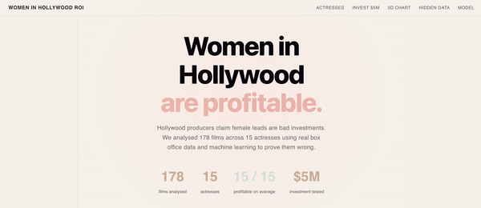
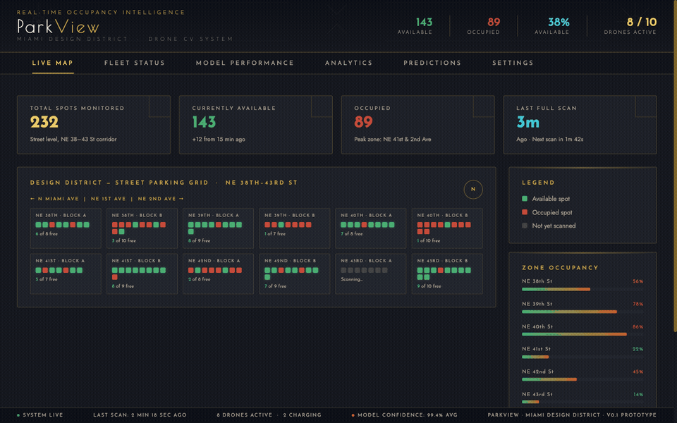
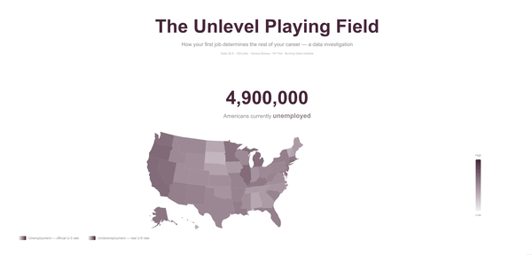
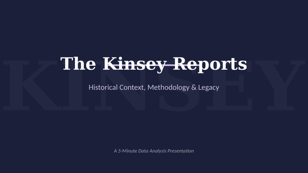
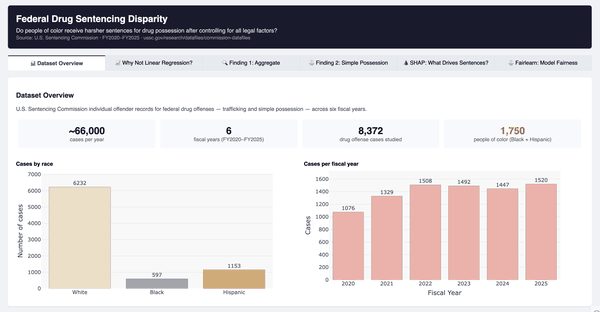
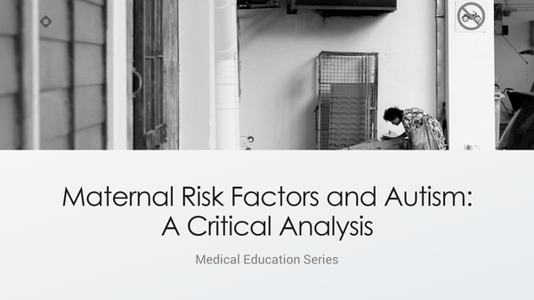

# Hi, I'm Fabiana 👋

Data scientist and developer at **NOD Coding Stockholm** — I build ML models and interactive dashboards that tell stories data usually hides.

---

## Projects

<table>
  <tr>
    <td align="center" width="50%">
      <strong>Women in Hollywood ROI</strong> 
       
      ML model + React dashboard · scikit-learn · FastAPI · Plotly
    </td>
    <td align="center" width="50%">
      <strong>China Luxury Retail — LSTM Forecasting</strong> 
       
      LSTM time series · TensorFlow · Bear/Base/Bull scenarios · LVMH Asia growth
    </td>
  </tr>
  <tr>
    <td align="center" width="50%">
      <strong>ParkView — Drone Parking System</strong> 
       
      YOLOv8-nano · Drone CV · Real-time dashboard · City of Miami proposal
    </td>
    <td align="center" width="50%">
      <strong>Job Market Dashboard</strong> 
       
      Labor market visualization · React · Vite · BLS data
    </td>
  </tr>
  <tr>
    <td align="center" width="50%">
      <strong>Kinsey Reports — Data Reanalysis</strong> 
       
      Statistical reanalysis · Python · Matplotlib · Seaborn
    </td>
    <td align="center" width="50%">
      <strong>Federal Sentencing Disparity</strong> 
       
      Interactive dashboard · Python · Plotly · federal courts data
    </td>
  </tr>
  <tr>
    <td align="center" width="50%">
      <strong>Maternal Risk Factors & Autism</strong> 
       
      EDA · pandas · Matplotlib · Seaborn · global dataset
    </td>
    <td></td>
  </tr>
</table>

---

## Tools & Technologies

